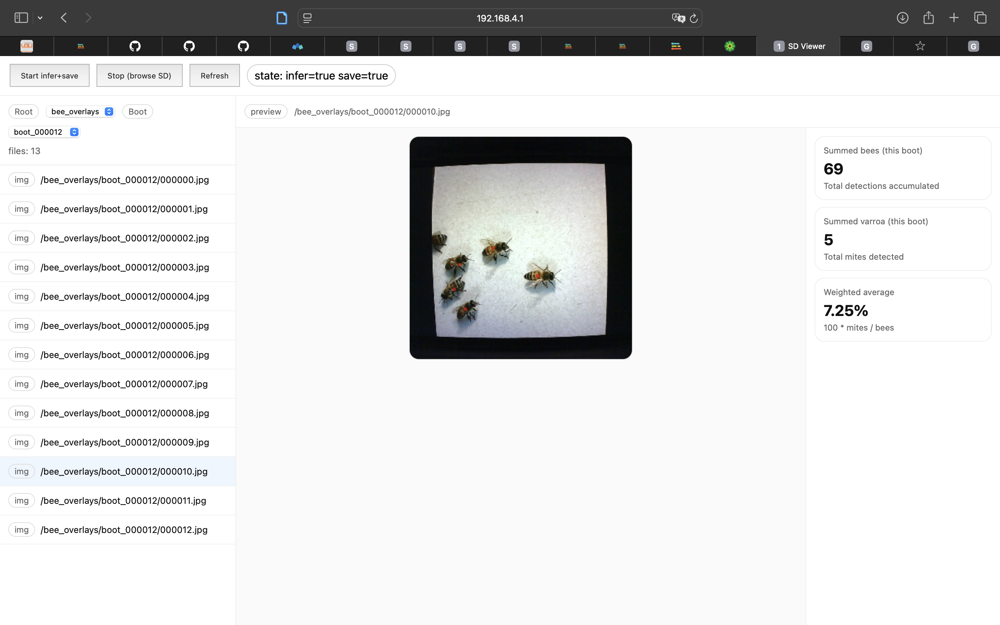
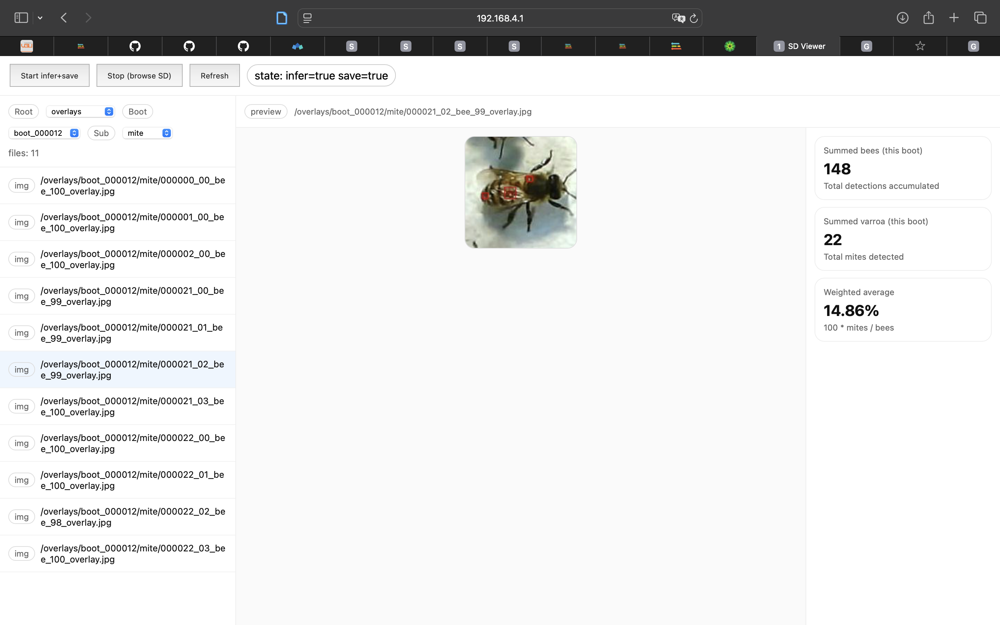
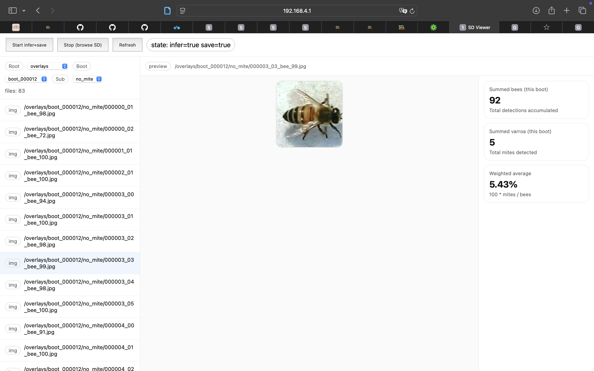
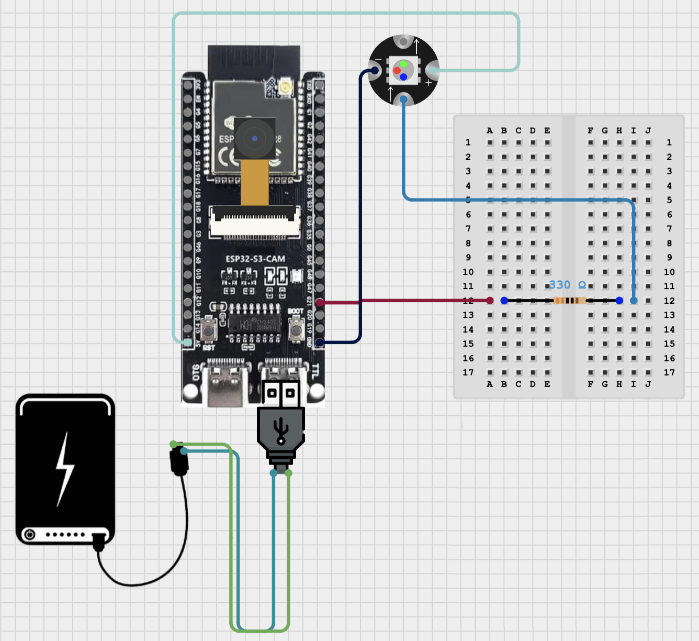

# Varroa Infestation Monitoring (ESP32-S3 + OV2640)

This repository contains an Arduino sketch (`final_clean/final_clean.ino`) that runs an Edge Impulse image pipeline on an **ESP32-S3-N16R8** camera module with an **OV2640** sensor, logs results to microSD, and serves a lightweight Wi-Fi web UI from the device.

## Hardware requirements

* **ESP32-S3-N16R8** camera module (PSRAM required).
* **OV2640** camera module.
* **microSD card** (formatted FAT32).
* **NeoPixel-compatible status LED** (1x RGB LED).
* Power supply and wiring per the pin map below.

## Pin map (from firmware)

The firmware pins are defined in `final_clean/src/app_config.h`. Update these if your wiring differs.

### Camera (OV2640)

| Signal | GPIO |
| --- | --- |
| XCLK | 15 |
| SIOD (SDA) | 4 |
| SIOC (SCL) | 5 |
| Y2 | 11 |
| Y3 | 9 |
| Y4 | 8 |
| Y5 | 10 |
| Y6 | 12 |
| Y7 | 18 |
| Y8 | 17 |
| Y9 | 16 |
| VSYNC | 6 |
| HREF | 7 |
| PCLK | 13 |
| PWDN | -1 (not used) |
| RESET | -1 (not used) |

### microSD (SD_MMC, 1-bit mode)

| Signal | GPIO |
| --- | --- |
| SD_CLK | 39 |
| SD_CMD | 38 |
| SD_DATA0 | 40 |

### NeoPixel LED

| Signal | GPIO |
| --- | --- |
| LED Data | 21 |

## Arduino IDE setup

### 1) Install the ESP32 board package

Install **Espressif ESP32** support in Arduino IDE (Boards Manager). Use the board manager URL below:

* `https://espressif.github.io/arduino-esp32/package_esp32_index.json`

The sketch relies on:

* `WiFi.h`, `WebServer.h`
* `esp_camera.h`
* `FS.h`, `SD_MMC.h`
* `img_converters.h` (from the ESP32 camera support)

These are part of the Arduino-ESP32 core.

### 2) Install required libraries

* **Adafruit NeoPixel** (`Adafruit_NeoPixel.h`).
* **Edge Impulse exported library** included in this repo: `libraries/merge_b.zip`.

To install the Edge Impulse library in Arduino IDE:

1. **Sketch → Include Library → Add .ZIP Library...**
2. Select `libraries/merge_b.zip` from this repository.

### 3) Board and build settings

In **Tools** menu (Arduino IDE):

* **Board:** ESP32S3 Dev Module (or your ESP32-S3-N16R8 variant)
* **PSRAM:** OPI PSRAM (required)
* **Flash Size:** 16MB
* **Partition Scheme:** Huge APP (required)

### 4) Open and upload

1. Open `final_clean/final_clean.ino`.
2. Select the correct serial port.
3. Upload.

## Running the project

* On boot, the device mounts the SD card and starts a Wi-Fi AP.
* **Wi-Fi SSID:** `ESP32-SD`
* **Wi-Fi password:** (open / none)
* Open the serial monitor to see the assigned IP and log output.

The web UI is served from the device and shows:

* Current inference state (enabled/disabled)
* Rolling counts of bees vs. mites
* SD-backed image browsing APIs

## Web UI screenshots

## Wiring diagram

## Project structure (high level)

* `final_clean/`: Arduino sketch folder (open `final_clean/final_clean.ino` to run inference).
* `final_clean/src/`: camera, SD card, UI, and pipeline logic.
* `libraries/merge_b.zip`: Edge Impulse library export.
* `merger/`: helper Python code used to merge and produce `merge_b.zip`.

## Notes

* The camera configuration uses `FRAMESIZE_SXGA` (1280x1024) and saves JPEG frames to the SD card.
* NeoPixel status LED: green when infestation rate ≤ threshold, red above threshold.
